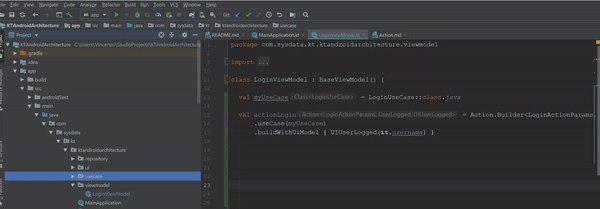
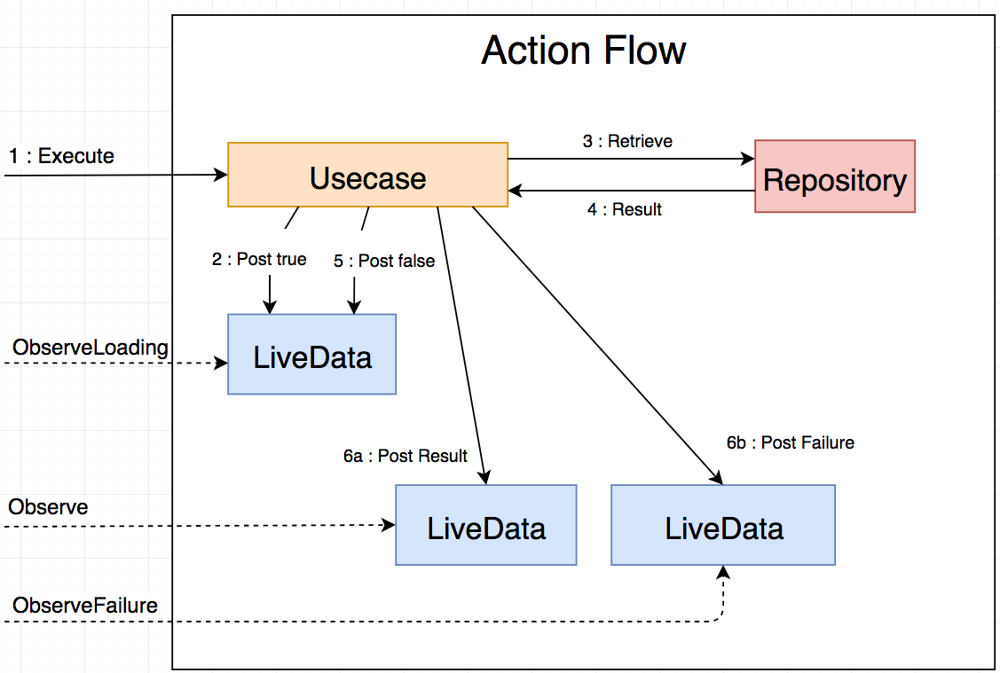

# KTAndroidArchitecture
A Kotlin android architecture with Google Architecture Components
## 1. A Brief Introduciton
The app is a sample project that shows how to implement the KTAndroidArchitecture into your Android app.

### 1.1 What is KTAndroidArchitecture?
It is a layer-based architecture that allows a real decoupling of the UI components from the business logic. 


The main components are:

* [UIModel](docs/UiModel.md)
* [UseCase](docs/UseCase.md)
* [Repository](docs/Repository.md)
* [Action](docs/Action.md)

Here you can find a list of guides depending on your implementations :
* [DI - Use with Dagger](docs/DI-Dagger.md)

## 2&#46; How to use it?

### 2.1 Import dependency

#### 2.1.1 in **Project level `build.gradle`** add this repository
```gradle
   maven { url  'https://dl.bintray.com/sysdata/maven' }
```
#### 2.1.2 in your **App level `build.gradle`** add this dependecy
```gradle
    implementation 'it.sysdata.mobile:ktandroidarchitecturecore:1.0.2'
```

#### 2.1.3 import the settings for use live template and file template

* [Settings.zip](docs/settings.zip)


### 2.2 Create a Repository
A repository just needs to extend **BaseRepository** in this way 
```kotlin
  class AuthRepository:BaseRepository() 
```

### 2.3 Create a UseCase
A usecase has to extend **UseCase<Out,In>** and implement a the "run" method:
```kotlin
class LoginUseCase: UseCase<UserLogged, LoginActionParams>() {
    override suspend fun run(params: LoginActionParams): Either<Failure, UserLogged> {
        do something
        return result
    }
}
```
or you can just create a new usecase by going to File Template New->Kotlin Use Case




The "run" function defined inside the UseCase can return a **Failure object** or a **Model object**.

The input params are defined in a Param object which is a data class defined like this
```kotlin
data class LoginActionParams(val email: String, val password: String) : ActionParams()
```

### 2.4 Create a ViewModel for your Activity/Fragment

A ViewModel needs to extend the abstract class BaseViewModel 
```kotlin
class LoginViewModel: BaseViewModel()
```

#### 2.4.1 Define an Action inside the ViewModel

An **Action** can be created by using a Builder like this
```kotlin
val actionLogin = Action.Builder<ActionParams,Model,UiModel>()
            .useCase(LoginUseCase::class.java)
            .buildWithUiModel { UiModel(it) }
```
or you can just use the live template **ac** to create a usecase straight from the class!




The flow is composed by the following steps:

1. The execution of an Action performed by the method execute(...) of Action class.
2. The first logical step is the post of an object inside an internal livedata called LoadingLiveData indicating that loading has started. The UI can observe this LiveData using the method observeLoadingStatus(...).
3. The next step is the execution of a usecase which uses repositories to retrieve some data.
4. The result of repositories' call is returned to the usecase.
5. The post of an object inside an internal livedata called LoadingLivedata indicating that loading has finished. The UI can observe this LiveData using the method observeLoadingStatus(...)
6. the post of the usecase result in two internal livedatas based on the success or the failure; the UI can observe these two LiveDatas by using observe(...) and observeFailure(...)

### 2.5 Call the Action from the Activity/Fragment


An action has several methods like:
- ``` action?.observe(...) ```, this method observes the success of the operation defined inside the usecase;
- ``` action?.observeFailure(...) ```, this method observes the failure of the operation; 
- ``` action?.observeLoadingStatus(...) ```, this method observes the loading state of the operation; 
- ``` action?.execute(...) ```, this method calls the "run" function inside the usecase and executes the operation;

To call an action you have to write this:
```kotlin
        viewModel?.action?.observe(this, ::onActionSuccess)
        viewModel?.action?.observeFailure(this, ::onActionFailed)
        viewModel?.action?.execute(Params)
```

## 3 KTAndroidArchitecture main components

### 3.1 UI

The UI layer of the architecture includes Activities, Fragments and Views. 

### 3.2 UIModel

A **UIModel** is an object that contains all UI-related datas of a view, fragment or activity.

[Read More](docs/UiModel.md)

### 3.3 ViewModels with Livedata

Each activity or fragment could have a **ViewModel** which is an object designed to store and manage UI-related data in a lifecycle aware way by defining some **Actions** to call one or more **UseCases**

### 3.4 UseCase
A **UseCase** is a wrapper for a small business logic operation. A **UseCase** can use one or more **Repository** to retrieve or to set data, then it returns the response event.

[Read More](docs/UseCase.md)

### 3.5 Repository
A **Repository** handles the process of saving or retrieving data from a datasource, it is managed by one or more **UseCase**.

[Read More](docs/Repository.md)

### 3.6 Action
An **Action** handles the process of calling a **UseCase** and map the response. Usually, an action uses only one **UseCase**, but it is possible to define an **ActionQueue** in order to call multiple **UseCases** sequentially.
Into an **ActionQueue** each **UseCase**, except the first, takes the result of the previous as parameters and gives the output to the next one.

**Action**


```kotlin
val actionLogin = Action.Builder<ActionParams,Model,UiModel>()
            .useCase(LoginUseCase::class.java)
            .buildWithUiModel { UiModel(it) }
```

**ActionQueue**


```kotlin
val actionQueue = ActionQueue.Builder<LoginActionParams, UserLogged>()
        .setFirstUseCase(FirstUseCase::class.java)
        .addUseCase(...)
        .setLastUseCase(...)
```
or just **acq** command live template


Optionally, you can add a CoroutineScope to the action. 

```kotlin
actionLogin.execute(LoginActionParams(username, password), viewModelScope)
```

For more informations about the CoroutineScope, 
please refer to [this medium article]: https://medium.com/androiddevelopers/easy-coroutines-in-android-viewmodelscope-25bffb605471 or
to [to the official documentation]: https://kotlin.github.io/kotlinx.coroutines/kotlinx-coroutines-core/kotlinx.coroutines/-coroutine-scope/.

## CHANGELOG ##

**1.0.2**
- Added Scope to actions.

**1.0.1**
- fixed abnormal behavior on ActionQueue.
- Added the possibility to add the action instance instead of the class. This is useful for dependency injection (i.e. Dagger).
- Added ActionSingle.
- fixed the behavior of the error post in the observeFailure function.
- Updated Gradle plugin version.

# License

      Copyright (C) 2019 Sysdata S.p.A.

      Licensed under the Apache License, Version 2.0 (the "License");
      you may not use this file except in compliance with the License.
      You may obtain a copy of the License at

          http://www.apache.org/licenses/LICENSE-2.0

      Unless required by applicable law or agreed to in writing, software
      distributed under the License is distributed on an "AS IS" BASIS,
      WITHOUT WARRANTIES OR CONDITIONS OF ANY KIND, either express or implied.
      See the License for the specific language governing permissions and
      limitations under the License.
 
